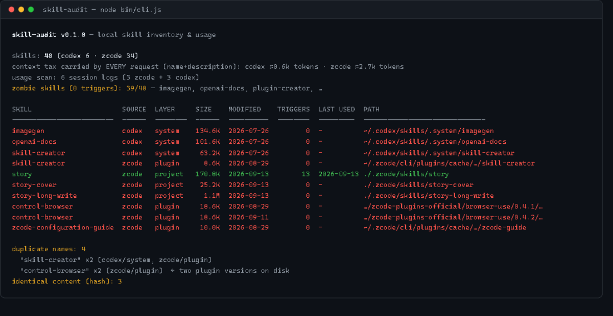

# skill-audit

> Your agents installed 40 skills. You use 3. Find out which — and what the other 37 are costing you.

`skill-audit` is a local-first CLI that inventories every AI-agent skill installed on your
machine, flags duplicates and stale copies, and reads your local session logs to show which
skills are actually triggered — and which are zombies that still ride along in your system
prompt on **every single request**.

**Zero dependencies · zero network · zero telemetry · no API keys · no build step**



## Why

Agent skills (the open `SKILL.md` format) are cheap to install and free to forget:

- Every installed skill's name + description is carried in the system prompt of every
  request, whether or not it ever fires. 100 installed skills ≈ thousands of tokens of
  permanent context tax.
- Plugin upgrades leave stale copies behind — on the author's machine, `browser-use` 0.4.1
  and 0.4.2 were both live on disk, with byte-identical skills in each.
- skills.sh and friends solve distribution ("install"). Nobody solves the afterlife:
  what's installed, what's duplicated, what's stale, what's dead.

## Demo (real output from the author's machine)

```text
skill-audit v0.1.0 — local skill inventory & usage
project: D:/Workspace/Zcode/.zcode/workspace/default

skills: 40 (codex 6 · zcode 34)
context tax carried by EVERY request (name+description): codex ≈0.6k tokens · zcode ≈2.7k tokens
usage scan: 6 session logs (3 zcode + 3 codex); codex counts are ≈ estimates
zombie skills (0 triggers): 39/40 — imagegen, openai-docs, plugin-creator, …

SKILL            SOURCE  LAYER     SIZE   MODIFIED    TRIGGERS  LAST USED  PATH
---------------  ------  --------  -----  ----------  --------  ---------  ---------------------------------
story            zcode   project   170.8K 2026-09-13        13  2026-09-13 ./.zcode/skills/story
story-cover      zcode   project   25.2K  2026-09-13         0  -          ./.zcode/skills/story-cover
…
skill-creator    codex   system    63.2K  2026-07-26         0  -          ~/.codex/skills/.system/skill-creator
skill-creator    zcode   plugin    8.6K   2026-08-29         0  -          ~/.zcode/cli/plugins/cache/...

duplicate names: 4
  "skill-creator" x2 (codex/system, zcode/plugin)
  "control-browser" x2 (zcode/plugin)     <- two plugin versions on disk
identical content (hash): 3
```

## Supported agents

| Agent       | Inventory                          | Usage analysis                          |
| ----------- | ---------------------------------- | --------------------------------------- |
| ZCode       | project / user / plugin cache      | exact (session rollout JSONL)           |
| Codex CLI   | user (`~/.codex/skills`, `.system`)| ≈ estimate (baseline-diff of path mentions) |
| Claude Code | project / user / plugins           | exact (`~/.claude/projects` JSONL)      |
| Gemini CLI / OpenCode / Cursor | user & project dirs scanned when present | not yet |

## Usage

```bash
git clone https://github.com/CCCCCSD/skill-audit && cd skill-audit

node bin/cli.js                      # scan cwd + user dirs + logs, full report
node bin/cli.js --dir ~/my/project   # count project-level skills of a specific project
node bin/cli.js --json               # machine-readable
node bin/cli.js usage                # trigger counts only
node bin/cli.js --no-usage           # inventory only, don't touch session logs
```

Exit code is `0` even when zombies are found (script-friendly); `2` on bad arguments.

## How it works

- **Inventory** — walks each agent's known skill roots for `SKILL.md`, parses YAML
  frontmatter, hashes content (sha1), records size/mtime/layer (project / user /
  plugin / system).
- **Duplicates** — same normalized name across sources, and identical-content groups by hash.
- **Usage** — streams local session logs and counts evidence of a trigger: a `Skill`
  tool call, or a `<command-name>` expansion. Codex rollouts list every installed skill
  path once per session in the system prompt, so mentions beyond that per-session baseline
  estimate an actual load (marked `≈`).
- **Context tax** — offline estimate of the name+description tokens every installed skill
  adds to each request (`≈ chars/4`, deliberately dependency-free).

### Known limitations

- Usage is matched by skill name across sources; same-named skills share counts.
- The currently-open agent session is itself being logged, so its counts can move under
  your feet.
- Log formats are undocumented and version-dependent. Parsers fail soft: a format change
  degrades to inventory-only, never a crash.

## Privacy

Everything runs on your machine. Session logs contain your code — skill-audit only reads
them in place, never copies them, and ships with no telemetry of any kind.

## Roadmap

- [ ] `clean` — archive + uninstall zombies (with backup)
- [ ] trigger-conflict detection — skills whose descriptions shadow each other
- [ ] TUI / HTML report
- [ ] More agent adapters (Windsurf, Roo, …) — see `lib/adapters.js`, PRs welcome

## Contributing

The moat is unglamorous: adapters for every agent's on-disk layout and log format.
If your agent isn't in the table, a 20-line adapter PR is the best contribution.

## License

MIT
